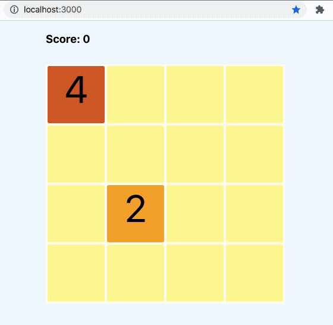

# 2048
##### A React App



## SUMMARY
This app is a React implementation of the game 2048.
It consists of a Board with multiple Tiles. The Board's state holds the values of all Tiles in a 2D-array and the Tiles a rendered accordingly. The player make moves using the arrow keys. After every move a new Tile is placed in a random free spot with a value of 2 or 4. When two tiles with the same value collides, they are merged into one with their combined value.


#### Tools versions:
- Terraform - 1.2.8
- Terragrunt - 0.36.1
- AWS Cli - 2.0.42

## Description

This solution was created to demonstrate how Continuous deployment based on "Infrastructure as a code" looks like. It consists of game 2048 it is deployed to, Terraform modules to create infrastructure and Terragrunt configuration to make deployment easier.

The solution creates an ECR repo, builds initial Docker image, creates a ECS Cluster, runs application on ECS Cluster and sets up Codebuild job which will start build and deploy by every commit to particular git branch ("develop" by default).

The repo contains the next components:

- Application itself
- Terragrunt deployment configuration
- Terraform modules
  - VPC - Creates network configuration
	- ECS - Creates a ECS Cluster and related services
	- Codebuild - Creates an AWS Codebuild job which starts automatically when code pushed to "develop" branch
	- ECR - Creates an Elastic Container repository
	- Init-Build - Builds and deploys initial image to ECR when new repository is created

## Folders and Files

- /app - Main Application folder
- /providers - Terragrunt directory
    - ./dev - DEV environment configuration
        - ./codebuild - Terragrunt configuration for "codebuild" module
	- ./ecr - Terragrunt configuration for "ecr" module
	- ./ecs - Terragrunt configuration for "ecs" module
  - ./vpc - Terragrunt configuration for "vpc" module
	- ./init-build - Terragrunt configuration for "init-build" module
	- ./buildspec.yml - Build SPEC for AWS Codebuild
	- ./terragrunt.hcl - Main Terragrunt configuration file for "DEV" environment. Contains variable values.
	- ./secrets.hcl - Contains secrets. File is not in repo because it is added to .gitignore. Should be created manually.
- /modules - Terraform modules

## Configuration

Main configuration files are the next:

/providers/dev/terragrunt.hcl - Contains main variables for Terragrunt & Terraform:
- remote_state_bucket - S3 bucket for Terraform states
- env - Environment name (dev, prod, etc)
- app_name - Name of Application (will be used for naming AWS resources)
- app_port - Application port
- app_count - number of instances created
- task_cpu - the amount of cpu to create instances
- task_memory - the amount of memory to create instances
- task_definition - file name with configurations to create ECS
- image_tag - Default value for Docker image tag. Will be used for initial build
- repo_url - GitHub repo URL
- aws_profile - The name of [AWS Profile](https://docs.aws.amazon.com/cli/latest/userguide/cli-configure-profiles.html)
- aws_account - AWS Account ID
- aws_region - AWS Region for creating resources
- branch_pattern - Which branch changes should webhook watch on (e.g.: "^refs/heads/develop$")
- git_trigger_event - Event for [git webhook](https://docs.aws.amazon.com/codebuild/latest/APIReference/API_WebhookFilter.html)

You can set variable value during terragrunt run to override configuration. For example:

```
terragrunt apply -var="app_name=MY_VALUE"
```

/providers/dev/buildspec.yml - Pipeline file for AWS Codebuild.

## Deployment

### Preparation

 - Install the required versions of Terragrunt and Terraform
 - Configure AWS Cli for your account (see [here](https://docs.aws.amazon.com/cli/latest/userguide/cli-configure-files.html))
 - Download the repo content
 - Update "locals" block in providers/dev/terragrunt.hcl file
 - Obtain [GitHub token](https://docs.github.com/en/github/authenticating-to-github/creating-a-personal-access-token)
 - Create "secrets.hcl" file and add Github token:

```
inputs = {
  github_oauth_token = "GITHUB_TOKEN"
}
```

> If you want to change Application name, environment name or region do not forget to update buildspec.yml before deploying from sratch. If you want to change parameters when infrastructure already deployed, it will delete all of existing resources and deploy new infrastructure and application.

### One command deployment

 - Go to the /providers/dev directory and run:

```
terragrunt run-all init
```

- Then...

```
terragrunt run-all plan
```

- And if there is no issues in generated plan:

```
terragrunt run-all apply
```

### Step by step deployment

Step by step deployment should be done in the next order:

1. ECR creation (`providers/dev/ecr`)
2. Initial build (`providers/dev/init-build`)
3. VPC creation (`providers/dev/vpc`)
4. ECS creation (`providers/dev/ecs`)
5. Codebuild job setup (`providers/dev/codebuild`)

Go to each folder one by one and run:

```
terragrunt plan
```

- When plan is completed run:

```
terragrunt apply
```

- Go to the next directory when deployment completed.

When resources creation is finished you can push a new version to "dev" branch of the repo you described in `env.hcl` file to initiate a new build

### Destroy infrastructure

You can destroy everything you deployed with the next command which should be executed in `dev/` directory:

```
terraform run-all destroy
```

Or you can destroy components step by step in reverse order from deployment. Go to the appropriate directory and run:

```
terragrunt destroy
```

### Manual Version Rollback

In some cases you may need to rollback current version running on ECS. This can be done manually using Teraform & Terragrunt.

Before running Terragrunt you should go to Elastic Container Registry and select the tag of image you want to run on ECS. Then follow the next steps:

```
cd providers/dev/ecs && terragrunt plan --var image_tag="TAG_OF_REQUIRED_IMAGE"
```

Then review generated plan and if you agree to incoming changes, run:

```
terragrunt apply --var image_tag="TAG_OF_REQUIRED_IMAGE"
```

and confirm changes.

### Manual application build and deploy

To build and deploy application manually, first, you should go to application directory and run build

``` bash
cd app/

export AWS_PROFILE="YOUR AWS PROFILE NAME"
export TAG="NEW IMAGE TAG"
export APP_NAME="image-2048s" # (optional)
export ENV_NAME="dev" # (optional)

make build
```

Wait until application is deployed to ECR then go to `providers/dev/ecs`and run Terragrunt:

```
terragrunt plan --var image_tag="NEW IMAGE TAG"
```

Then review generated plan and if you agree to incoming changes, run:

```
terragrunt apply --var image_tag="NEW IMAGE TAG"
```

and confirm changes.
